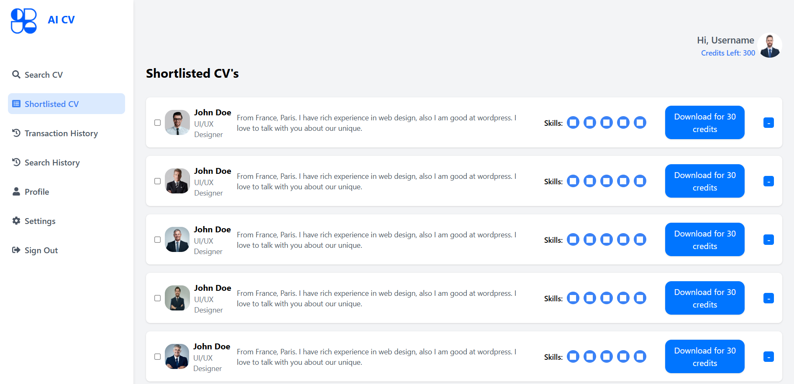
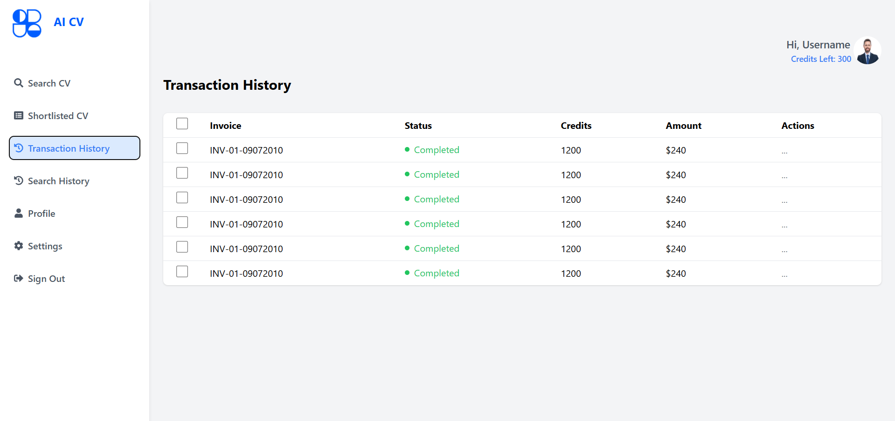

# AI-CV

## Description
AI-CV is a responsive web application built using ReactJS and Tailwind CSS, designed to streamline the process of managing shortlisted CVs. The application provides a visually appealing and intuitive interface for recruiters to view, organize, and download candidate profiles efficiently.


### Live Demo
✨ [Check out the AI-CV Live Site](https://ai-cv-rajat4323s-projects.vercel.app/)

---

## Features

- **Dynamic Profile Display** : Showcases candidate profiles with unique images, descriptions, and skills in a neatly structured layout.
- **Interactive UI Elements** : Includes checkboxes for selecting profiles and buttons for quick actions, such as downloading CVs.
- **Credits System**: Displays available credits and deducts them upon downloading CVs, enhancing accountability in usage.
- **Mobile Responsiveness** : Optimized layout adjustments for both desktop and mobile screens, ensuring a seamless user experience across devices.
- **Custom Styling** : Utilizes the flexibility of Tailwind CSS for consistent styling and responsiveness.

---

## Technologies Used

- **ReactJS** : Utilized to build a dynamic, component-based user interface for seamless interaction.
- **Tailwind CSS** : Incorporated for efficient styling and crafting a fully responsive, modern design.
- **JavaScript (ES6+)** : Employed for implementing functionality, handling interactivity, and ensuring smooth application logic.

---

## Installation Guide

Follow these steps to set up the project on your local machine:

1. **Clone the Repository**:
   Open your terminal and clone the repository:

   ```bash
   git clone https://github.com/Rajat4323/Ai-Cv.git

   ```

2. **Navigate to the Project Directory**:
   cd project-name

3. **Install Dependencies: Install the required dependencies using npm**:
   npm install

4. **Run the Application: Start the development server**:
   npm start

5. **Open in Browser: Navigate to http://localhost:3000 in your web browser to view the application**.

---

## 📷 Application Screenshots





## Contribution

Contributions are welcome! If you'd like to improve this project, follow these steps:

1. Fork the repository.

2. Create a new branch for your feature or bug fix:
   git checkout -b feature-name

3. Make your changes and commit them:
   git commit -m "Added a new feature"

4. Push the changes to your forked repository:
   git push origin feature-name

5. Create a pull request to the main repository.

---

## Contact

For any questions or suggestions, feel free to contact me:

Rajat Kumar
rajatkumar020304@gmail.com